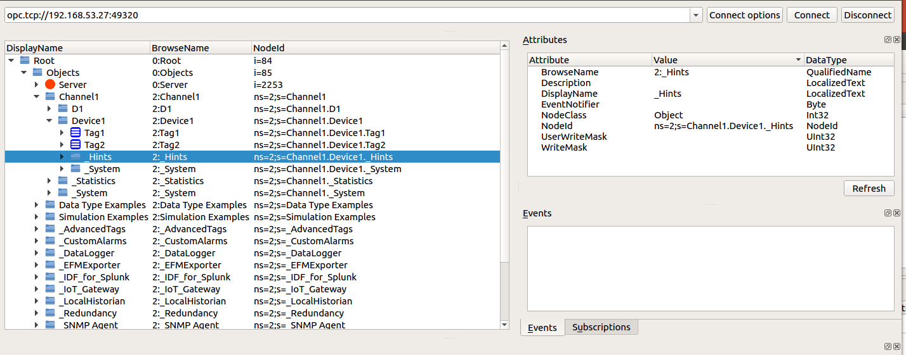
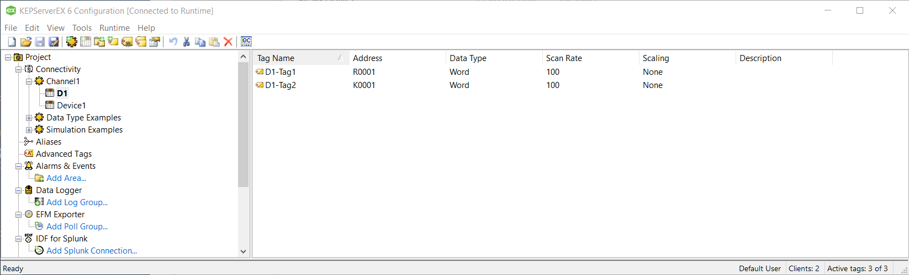

# thingsboard-opc-testing
Testing thingsboard opc gateway + KEPServerEX


# TEST 1
- configured the thingsboard and thingsboard opc gateway as described in https://thingsboard.io/docs/iot-gateway/getting-started/#step-9-connect-to-external-opc-ua-server
- debug log in tb-gateway_1.log
- based on code there should be some method calls to  
     public void scanForDevices()
     => not so easy to detect the logs from this method
     and to   
     private void scanForDevices(OpcUaNode node)
     => no debug prints from  private void scanForDevices(OpcUaNode node)

# TEST 2
- changed the thingsboard opc gateway configuration to
```
{
  "deviceNodePattern": "Device1",
  "deviceNamePattern": "Device1",
  "attributes": [
    {"key":"Tag1", "type": "string", "value": "${Tag1}"}
  ],
  "timeseries": [
    {"key":"Tag2", "type": "long", "value": "${Tag2}"}
  ]
}
```
- debug log in tb-gateway_2.log, at least now it tries to scan the tree for tags i.e there are debug output from  
  private void scanForDevices(OpcUaNode node)
 ```
  2017-11-06 14:49:55,568 [main] DEBUG o.t.g.e.opc.OpcUaServerMonitor - Scanning device node: OpcUaNode(nodeId=NodeId{ns=2, id=Channel1.Device1}, name=Device1, fqn=Objects.Channel1.Device1)
2017-11-06 14:49:55,571 [main] DEBUG o.t.g.e.opc.OpcUaServerMonitor - Scanning node hierarchy for tags: [Tag1, Tag2]
2017-11-06 14:49:55,591 [main] ERROR o.t.g.e.opc.OpcUaServerMonitor - Failed to scan device: Device1
java.lang.StringIndexOutOfBoundsException: String index out of range: -1
	at java.lang.String.substring(String.java:1931)
	at org.thingsboard.gateway.extensions.opc.OpcUaServerMonitor.lookupTags(OpcUaServerMonitor.java:319)
	at org.thingsboard.gateway.extensions.opc.OpcUaServerMonitor.scanDevice(OpcUaServerMonitor.java:191)
	at org.thingsboard.gateway.extensions.opc.OpcUaServerMonitor.lambda$scanForDevices$8(OpcUaServerMonitor.java:159)
	at java.util.ArrayList.forEach(ArrayList.java:1255)
```
The OpcUaNode(nodeId=NodeId{ns=2, id=Channel1.Device1}, name=Device1, fqn=Objects.Channel1.Device1) seems to be valid


So what might cause the above error ?
The error happens in the [lookupTags (OpcUaServerMonitor.java) ](https://github.com/thingsboard/thingsboard-gateway/blob/master/src/main/java/org/thingsboard/gateway/extensions/opc/OpcUaServerMonitor.java) method.

```
private Map<String, NodeId> lookupTags(NodeId nodeId, String deviceNodeName, Set<String> tags) {
       Map<String, NodeId> values = new HashMap<>();
       try {
           BrowseResult browseResult = client.browse(getBrowseDescription(nodeId)).get();
           List<ReferenceDescription> references = toList(browseResult.getReferences());

           for (ReferenceDescription rd : references) {
               NodeId childId;
               if (rd.getNodeId().isLocal()) {
                   childId = rd.getNodeId().local().get();
               } else {
                   log.trace("Ignoring remote node: {}", rd.getNodeId());
                   continue;
               }
               String browseName = rd.getBrowseName().getName();
               String name = browseName.substring(deviceNodeName.length() + 1); // 1 is for extra .
               if (tags.contains(name)) {
                 values.put(name, childId);
               }
               // recursively browse to children
               values.putAll(lookupTags(childId, deviceNodeName, tags));
           }
       } catch (InterruptedException | ExecutionException e) {
           log.error("Browsing nodeId={} failed: {}", nodeId, e.getMessage(), e);
       }
       return values;
   }
```
So the generated error java.lang.StringIndexOutOfBoundsException is raised in line 319 if the deviceNodeName.length() is negative or larger than the length of the browseName.

Based on the error log
```
2017-11-06 14:49:55,568 [main] DEBUG o.t.g.e.opc.OpcUaServerMonitor - Scanning device node: OpcUaNode(nodeId=NodeId{ns=2, id=Channel1.Device1}, name=Device1, fqn=Objects.Channel1.Device1)
2017-11-06 14:49:55,571 [main] DEBUG o.t.g.e.opc.OpcUaServerMonitor - Scanning node hierarchy for tags: [Tag1, Tag2]
2017-11-06 14:49:55,591 [main] ERROR o.t.g.e.opc.OpcUaServerMonitor - Failed to scan device: Device1
```
it can be assumed that the **deviceNodeName** is **Device1** , so the **deviceNodeName.length>0**.

So it can be assumed that one of the **ReferenceDescription** contains a **NodeId**, which
```
browseName.length<deviceNodeName.length()+1
```

As it can be seen:

the **Device1** contains not only the **Tag1** and **Tag2**, but other items as well, which means
```
    "Tag1".substring("Device1".length() +1 ) = -1
    "Tag2".substring("Device1".length() +1 ) = -1
    "_Hints".substring("Device1".length() +1 ) = -1
    "_System".substring("Device1".length() +1 ) = -1
```
Is this demo configuration never even tested?


# TEST 3
As now I have some ideas what is causing the error, the KEPServerEX configuration can be changed so that the error won't be raised again:



First attempt with
```
{
...
  "mapping": [
    {
      "deviceNodePattern": "D1",
      "deviceNamePattern": "D1",
      "attributes": [
        {"key":"Tag1", "type": "string", "value": "${D1-Tag1}"}
      ],
      "timeseries": [
        {"key":"Tag2", "type": "string", "value": "${D1-Tag2}"}
      ]
    }
    ...
  ]
}
```
fails as well.

But with opc gateway configuration like
```
{
...
  "mapping": [
    {
      "deviceNodePattern": "D1",
      "deviceNamePattern": "D1",
      "attributes": [
        {"key":"Tag1", "type": "string", "value": "${Tag1}"}
      ],
      "timeseries": [
        {"key":"Tag2", "type": "string", "value": "${Tag2}"}
      ]
    }
    ...
  ]
}
```
the data from the KEPServerEX from D1-Tag1 can be seen on Thingsboard.

So there is a lot of problems in the **OpcUaServerMonitor.java** which aren't easy to fix.
